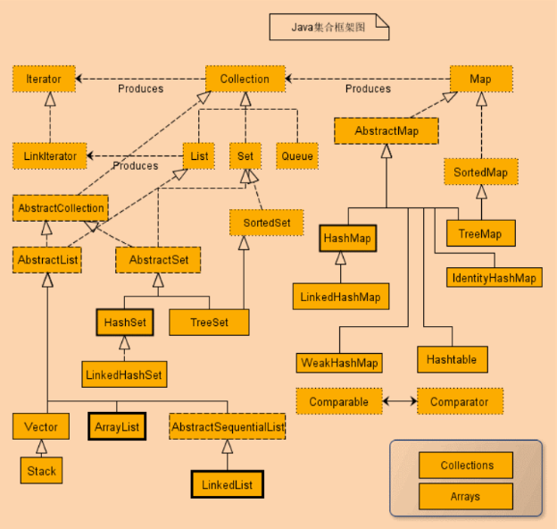
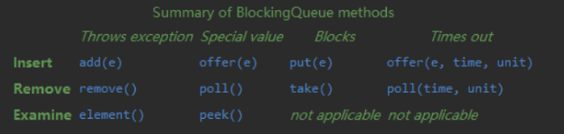
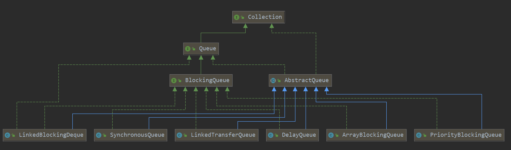

## 集合类
盗个图



主要分为Map和Collection接口，Collection下有List、Set和Queue。Map下有HashMap、TreeMap和LinkedHashMap。

## 为什么LinkedHashMap能保持插入顺序？
因为其内部实现为双向链表.

## EnumMap何时使用？

如果`map`的`key`是枚举类型，推荐使用`EnumMap`，因为其内部结构紧凑，用数组存储枚举`key`，不需要计算`hashcode`就能通过索引定位key，更加高效和节省空间。

## Queue的常见操作有哪些？有什么区别？

无非增加、删除和查看，文档注释里已经很明确，就是抛异常和返回`null`的区别。



`add`在队列满时会抛出`IllegalStateException`，例如`AbstractQueue`里的实现：

```java
    public boolean add(E e) {
        if (offer(e))
            return true;
        else
            throw new IllegalStateException("Queue full");
    }
```

但也不是所有队列实现都这样，`PriorityQueue`就和`offer`实现一样。

```java
    public boolean add(E e) {
        return offer(e);
    }
```

## 阻塞队列是什么？有哪些阻塞队列？

阻塞队列也是队列，比普通队列多了2个操作：阻塞获取和阻塞插入数据，分别对应方法：

`put`,`take` ,`offer(time)`, `poll(time)`

常见的阻塞队列如下：



## 每种阻塞队列有什么区别，在什么时候使用？

TODO

## comparator和comparable有什么区别？
Comparator是一个函数接口，叫比较器，一般作为参数传给某些集合类，比如TreeMap，PriorityQueue。

Comparable是一个普通接口，给需要比较的类实现。
他们都有compare方法，比较器的compare需要传入2个对象，而Comparable由于是类自己实现，只需要传入另一个对象和自己比较即可。

## Map如何按value排序？
https://stackoverflow.com/questions/109383/sort-a-mapkey-value-by-values

## ArrayList默认初始值多少？每次增长多少？
默认10，每次增长旧容量的一半,或者指定最小容量。

```java
private static final int MAX_ARRAY_SIZE = Integer.MAX_VALUE - 8;

private void grow(int minCapacity) {
    // overflow-conscious code
    int oldCapacity = elementData.length;
    int newCapacity = oldCapacity + (oldCapacity >> 1);
    if (newCapacity - minCapacity < 0)
        newCapacity = minCapacity;
    if (newCapacity - MAX_ARRAY_SIZE > 0)
        newCapacity = hugeCapacity(minCapacity);
    // minCapacity is usually close to size, so this is a win:
    elementData = Arrays.copyOf(elementData, newCapacity);
}

private static int hugeCapacity(int minCapacity) {
    if (minCapacity < 0) // overflow
        throw new OutOfMemoryError();
    return (minCapacity > MAX_ARRAY_SIZE) ?
        Integer.MAX_VALUE : MAX_ARRAY_SIZE;
}
```

## ListIterator怎么使用，和Iterator的区别是？

可以向前遍历，只能是List使用。

```java
  // list of names
List<String> names = new LinkedList<>();
names.add("learn");
names.add("from");
names.add("Geeksforgeeks");

// Getting ListIterator
ListIterator<String> listIterato = names.listIterator();

// Traversing elements
System.out.println("Forward Direction Iteration:");
while (listIterator.hasNext()) {
    System.out.println(listIterator.next());
}

// Traversing elements, the iterator is at the end
// at this point
System.out.println("Backward Direction Iteration:");
while (listIterator.hasPrevious()) {
    System.out.println(listIterator.previous());
}
```


