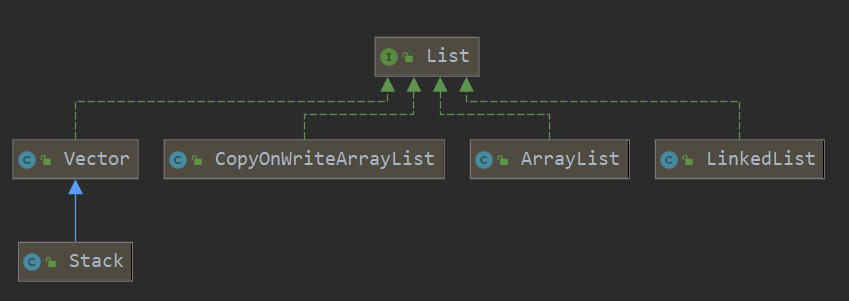
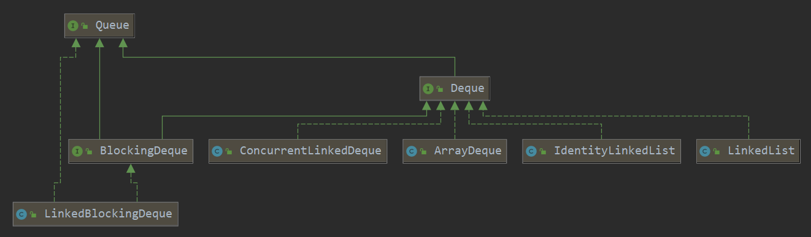

## 集合类
盗个图


主要分为Map和Collection接口，Collection下有List、Set和Queue。Map下有HashMap、TreeMap和LinkedHashMap。

## 为什么LinkedHashMap能保持插入顺序？
因为其内部实现为双向链表.

## EnumMap何时使用？

如果`map`的`key`是枚举类型，推荐使用`EnumMap`，因为其内部结构紧凑，用数组存储枚举`key`，不需要计算`hashcode`就能通过索引定位key，更加高效和节省空间。

## Queue的常见操作有哪些？有什么区别？

无非增加、删除和查看，文档注释里已经很明确，就是抛异常和返回`null`的区别。


`add`在队列满时会抛出`IllegalStateException`，例如`AbstractQueue`里的实现：

```java
    public boolean add(E e) {
        if (offer(e))
            return true;
        else
            throw new IllegalStateException("Queue full");
    }
```

但也不是所有队列实现都这样，`PriorityQueue`就和`offer`实现一样。

```java
    public boolean add(E e) {
        return offer(e);
    }
```

## 阻塞队列是什么？有哪些阻塞队列？

阻塞队列也是队列，比普通队列多了2个操作：阻塞获取和阻塞插入数据，分别对应方法：

`put`,`take` ,`offer(time)`, `poll(time)`

常见的阻塞队列如下：


## 每种阻塞队列有什么区别，在什么时候使用？

TODO

## comparator和comparable有什么区别？
Comparator是一个函数接口，叫比较器，一般作为参数传给某些集合类，比如TreeMap，PriorityQueue。

Comparable是一个普通接口，给需要比较的类实现。
他们都有compare方法，比较器的compare需要传入2个对象，而Comparable由于是类自己实现，只需要传入另一个对象和自己比较即可。

## Map如何按value排序？
https://stackoverflow.com/questions/109383/sort-a-mapkey-value-by-values

## ArrayList默认初始值多少？每次增长多少？
默认10，每次增长旧容量的一半,或者指定最小容量。

```java
private static final int MAX_ARRAY_SIZE = Integer.MAX_VALUE - 8;

private void grow(int minCapacity) {
    // overflow-conscious code
    int oldCapacity = elementData.length;
    int newCapacity = oldCapacity + (oldCapacity >> 1);
    if (newCapacity - minCapacity < 0)
        newCapacity = minCapacity;
    if (newCapacity - MAX_ARRAY_SIZE > 0)
        newCapacity = hugeCapacity(minCapacity);
    // minCapacity is usually close to size, so this is a win:
    elementData = Arrays.copyOf(elementData, newCapacity);
}

private static int hugeCapacity(int minCapacity) {
    if (minCapacity < 0) // overflow
        throw new OutOfMemoryError();
    return (minCapacity > MAX_ARRAY_SIZE) ?
        Integer.MAX_VALUE : MAX_ARRAY_SIZE;
}
```

## ListIterator怎么使用，和Iterator的区别是？

可以向前遍历，只能是List使用。

```java
  // list of names
List<String> names = new LinkedList<>();
names.add("learn");
names.add("from");
names.add("Geeksforgeeks");

// Getting ListIterator
ListIterator<String> listIterato = names.listIterator();

// Traversing elements
System.out.println("Forward Direction Iteration:");
while (listIterator.hasNext()) {
    System.out.println(listIterator.next());
}

// Traversing elements, the iterator is at the end
// at this point
System.out.println("Backward Direction Iteration:");
while (listIterator.hasPrevious()) {
    System.out.println(listIterator.previous());
}
```

## List有哪些实现类？实现原理是啥？



实现原理：

* ArrayList：内部是一个Object数组，注意其扩容机制，每次根据入参扩旧容量的一半或指定容量 `grow`方法
* LinkedList：双向链表结构，维护了链头和链尾指针，同时他也是 `Queue`的实现
* Vector：内部也是个Object数组，只是所有公共方法都加了同步操作，和ArrayList还有个区别就是其扩容是翻倍增加
* Stack：是Vector的子类，增加了 `pop,push,peek,search`方法
* CopyOnWriteArrayList: 是一个线程安全的 ArrayList，怎么实现线程安全的呢？
    * 里面使用了一个 `ReentrantLock`
    * 在 `set, add, remove`等修改方法上都加了锁
    * 另外，每个简单的修改都是Copy了一份新数据，所以内存开销是很大的，这么干是为了避免并发修改异常

## Deque和Queue有什么区别？

`Deque`是 `Double Ended Queue`的缩写，就是双端队列。



## Hashtable和HashMap有什么区别？

建议读一下2个类的源码实现，

`Hashtable`源码很简单，就是一个 `Entry`数组，每个 `Entry`后面跟着hash值一样的链表结构。
所有对外方法都用同步包裹，在add时会判断是否需要 `rehash`, `rehash`也很简单，将数组扩容（翻倍），然后重新hash数组索引位置到新数组。

本来JDK1.8以前，HashMap也是很简单的数组+链表结构，自从加了红黑树转换，代码就复杂了一些。
但抛开红黑树那块，基本逻辑还是不变的，但要注意几个细节的区别：

1. HashMap的大小一定是2的幂次方，为什么呢？
  * 因为新的hash方法，里面定位将这个元素放在数组哪个桶里时，不再是简单的通过取模运算： `hash % n`,
    而是使用位运算： `(n-1) & hash`, 你说这有什么好处？因为快呀，位运算比取模快多了。 
    为了保证这个计算结果和取模一样，n必须是2的幂次方。
2. `hashcode`不是简单取对象的`hashcode`，而是做了移位运算： `(h = key.hashCode()) ^ (h >>> 16)`,这又是为什么呢？
  * 当然是为了减少哈希冲突，举个例子吧：
  * key的hash值为 10101010-10101010-01011100-00000000,如果最低8位为0，我们的map长度n为16，
    那么`(n-1) & hash`算出来的是0，在很多时候，hash表的长度都在低16位，这个计算就相当于完全相信对象的hashcode。
    显然，JDK开发人员觉得这个可以优化。
3. 如果要同步map，使用 `ConcurrentHashMap`.

## ConcurrentHashMap如何实现并发安全？底层实现原理

1. 所有属性都设为了 `volatile`
2. 主要是使用Unsafe的原生方法来保证同步，比如：获取节点tabAt是调用的Unsafe的 `getObjectVolatile`
   替换值的 casTabAt,采用Unsafe的 `compareAndSwapObject`. 
3. putVal时，还是会用 `synchronized`锁住需要修改的节点 `Node`


