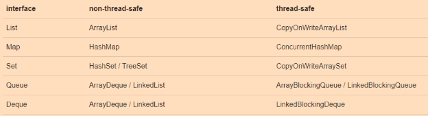

## 进程和线程的区别和优缺点？

线程是操作系统调度的最小单位，一个进程可以包含多个线程，抢占式运行。

* 进程的优点是：稳定，进程间几乎不会相互影响，而线程之间的影响可能会很明显；
* 进程的缺点是：创建开销比线程大，进程间通信更慢。

## 线程有哪些状态？

位于`Thread`类中的枚举类`Thread.State`


## 线程各个状态间如何流转？

注意什么情况下回进入`blocked`状态、调用哪些方法会进入`waiting`状态：
https://fangjian0423.github.io/2016/06/04/java-thread-state/

## 如何中断线程？

一般调用线程的 `interrupt()`方法中断，但是并不一定能成功，这取决于线程是否可中断。一般标准的实现是线程内部需要不断轮询 `isInterrupted()`标志，来响应中断请求。这才是一个良好的编程习惯。 对于有些`CPU`
密集型计算，可能就无法响应中断，线程无法停止。

## Object的wait方法为何存在？wait时底层会做什么操作？wait的正确用法是什么？

https://www.liaoxuefeng.com/wiki/1252599548343744/1306580911915042

`wait`会将调用者的监视器锁释放，供其他线程获取，代表自己需要等待条件合理再继续执行，`wait`会一直等待其他线程调用`notify`或`notifyAll`，然后才返回。是个`native`方法。

`wait`使用有2个注意事项：

1. 一定要在获得锁的对象上使用，就是`synchronized(obj)`里面`obj.wait()`;否则会抛`IllegalMonitorStateException`
2. 一般要在循环里调用`wait`，因为当线程被唤醒时，还需要再次判断条件是否正确，如下：

```java
synchronized(obj){
        while(条件不满足){
        obj.wait();
        }
        // 正常操作
        }
```

## 写一段代码，使用wait和notify实现生产消费者模型

TODO

## sleep和wait有何区别？

* `sleep`是`Thread`的方法，`wait`是`Object`的方法。
* `sleep`不会释放锁，`wait`会释放。

## 那 `sleep(0)`有什么作用？

`sleep`代表当前线程原因让出指定时间的CPU给其他线程用，当这个时间为0，并不代表就不让出CPU了， 而是**通知操作系统立即重新发起一次CPU竞争**，看有没有更高优先级的线程需要使用CPU。
因为在抢占式操作系统调度实现里，如果一个线程优先级很高，除非他主动让出CPU，否则其他线程很难抢到。

比如在大循环里经常写一句 `sleep(0)`,可以给其他线程比如`Paint`线程获得CPU的权利，减少界面卡死。

## notify唤醒哪一个线程？

由虚拟机决定。 怎么决定呢？ TODO

## 为什么thread的start只能调用一次？

因为方法里实现是这样，状态不为`New`时会抛`IllegalThreadStateException`异常。

## ReentrantLock和synchronized有什么区别？什么时候用ReentrantLock？

`Reentrant`是`re-entrant`，也就是可重入锁的意思，`synchronized`也是可重入的。

`ReentrantLock`需要手动加锁释放锁，自由度更高， 而`synchronized`由虚拟机控制加锁释放，使用更简单。

而`ReentrantLock`可以使用`tryLock`等待指定时间获取锁，如果没等到，可以放弃； 而`synchronized`无法做到。

因此，超时可控时可以用`ReentrantLock`。 对于效率，经过Java6的优化之后，`synchronized`已经没那么重了，下面是一个对比测试： 使用同步对一个变量进行递增，在`1000`并发下的比较。

```java
    static class A {
    int count;

    public synchronized void add() {
        count++;
    }
}

static class B {
    int count;
    private final Lock lock = new ReentrantLock();

    public void add() {
        lock.lock();
        try {
            count++;
        } finally {
            lock.unlock();
        }
    }
}

    @Test
    public void testLock() throws InterruptedException {
        int n = 1000;
        ExecutorService pool = Executors.newFixedThreadPool(n);
        // A a = new A();
        B a = new B();
        for (int i = 0; i < n; i++) {
            pool.execute(() -> {
                for (int j = 0; j < 10000; j++) {
                    a.add();
                }
            });
        }
        pool.shutdown();
        pool.awaitTermination(1, TimeUnit.MINUTES);

        System.out.println("Count=" + a.count);
    }
```


跑了几次发现，synchronized平均还是比ReentrantLock慢一些的。

## ReentrantLock如何实现 wait和notify？

使用`Condition`，`lock.newCondition()`;
`condition`有`await`和`signal`方法，还可以实现超时等待。

## 读写锁应用在什么场景？

`ReadWriteLock`也就是读写锁，适合读多写少的场景，因为允许多个线程同时读，只要有一个线程在写就必须等待。

## 读写锁是如何实现的？

TODO

https://zhuanlan.zhihu.com/p/91408261


## StampedLock用在什么场景？

`StampedLock`是`JDK1.8`实现的读写锁升级版，来减少写的时候也要等读锁释放的问题。也就是读的时候可以先不加锁，采用乐观读，然后判断下有没有线程在写，如果有，就升级为读锁，否则就执行走了。 文章翻译了注释中的代码：
https://www.liaoxuefeng.com/wiki/1252599548343744/1309138673991714

## 常用集合对应的线程安全类是什么？



## Atomic类就很好吗？什么情况下性能很差？

`Atomic`是无锁实现并发，采用`CMS`的方式，基于`CPU`的一条原子比较交换指令。采用循环的方式不断尝试修改值。

所以，当竞争很少的情况下还是很快的。但竞争激烈时，`CPU`就会很忙，这时候可以使用`JDK1.8`里的`XxxAdder`或`XxxAccumulator`类，Xxx代表数据类型, 只有`Long`和`Double`
两种类型，因为只有他们是`64`位数据类型。

## Adder和Accumulator有什么区别呢？

`Adder`是`Accumulator`是一种特例，相当于初始值为`0`，计算函数为加法。

`LongAdder()` 等价于 `LongAccumulator((x, y) -> x + y, 0L)`.

## 线程池的submit和execute方法有什么区别？

`execute`是`Executor`接口的方法，`submit`是`ExecutorService`接口的方法，`ExecutorService`是`Executor`是子接口，增加了`submit`
方法，可以返回结果，可以提交`Callable`任务。

## 线程池有哪些状态？

注意和线程的状态区分开，查看`ThreadPoolExecutor`的文档可知状态：

```java
/*   RUNNING:  Accept new tasks and process queued tasks
 *   SHUTDOWN: Don't accept new tasks, but process queued tasks
 *   STOP:     Don't accept new tasks, don't process queued tasks,
 *             and interrupt in-progress tasks
 *   TIDYING:  All tasks have terminated, workerCount is zero,
 *             the thread transitioning to state TIDYING
 *             will run the terminated() hook method
 *   TERMINATED: terminated() has completed
 *----------------------------状态转换------------------------------------
 *  RUNNING -> SHUTDOWN
 *    On invocation of shutdown(), perhaps implicitly in finalize()
 * (RUNNING or SHUTDOWN) -> STOP
 *    On invocation of shutdownNow()
 * SHUTDOWN -> TIDYING
 *    When both queue and pool are empty
 * STOP -> TIDYING
 *    When pool is empty
 * TIDYING -> TERMINATED
 *    When the terminated() hook method has completed
 */
```

## ThreadPoolExecutor的参数要熟练掌握
* `coreSize`：小于`coreSize`个线程，来了新任务会直接创建线程；
* `maxSize`：
* `queue`：`coreSize`的线程都在工作，会将任务塞到队列里，队列满了，如果`maxSize`大于`coreSize`，才会创建新的线程。也就是说，如果队列是无限队列，那么`maxSize`这个参数根本没用。
* `keep alive time`：超过`coreSize`的线程在超过指定时间才会被终结，但是`allowCoreThreadTimeout`可以设置核心线程也超时。
里面有个同步队列很有意思：`handoff`工作方式，也就是缓存线程池的默认队列，容量相当于0，需要立即传递，因此`maxSize`才是`Int`最大值。

## CompletableFuture的应用场景？
https://www.liaoxuefeng.com/wiki/1252599548343744/1306581182447650

`JDK1.8`出的，算是弥补`Future`同步获取结果和异步轮询结果的限制，
`CompletableFuture`可以异步回调结果。 还可以穿行执行一批任务、并行执行并取其中一个结果。

## CountDownLatch的应用场景？
https://juejin.cn/post/6989201934699741191

主要是`await`和`countdown`方法

## ForkJoinPool是什么？
https://www.liaoxuefeng.com/wiki/1252599548343744/1306581226487842

从`JDK1.7`开始出现，采用的是`Fork`和`Join`的思想，用于执行`ForkJoinTask`，比如其中一个实现`RecursiveTask`，递归执行任务。其采用的调度算法为`work-stealing`，在论文里介绍了，还没研究，据说能减少等待和提高效率。

从`JDK1.8`开始，`Executors`出现了 `newWorkStealingPool()`,就是调用`ForkJoinPool`.

## ThreadLocal的实现原理？

在`Thread`类里有一个`ThreadLocalMap`属性，也就是每个线程实例都会保存这个`map`，
`ThreadLocal`类就是调用线程的这个`map`设置值和获取值。

`ThreadLocalMap`里是一个`Entry`的数组，每个`Entry`的`Key`是带有泛型的`ThreadLocal`实例，`Value`就是泛型值，获取值和设置值是通过计算索引来定位数组中的值，关于这个过程，还涉及数学里的分布。可以参考：
https://juejin.cn/post/6844903648800014349

## 多线程中synchronized锁升级的原理是什么？

## synchronized怎么实现的？

## 怎样防止死锁？
1. 尽量使用带超时的锁
2. 尽量使用系统自带的并发类代替自己写锁
3. 少共用锁
4. 减少锁粒度（这个不绝对，比如在一个循环里加锁就得评估一下，可能加载循环外更好）
5. 加锁顺序要一致

## Callable和Future有什么区别？
`Callable`是类似`Runnable`接口的任务接口，区别是带有返回值，而`Future`就是用来获取返回值的，一个产生结果，一个获取结果。

## 乐观锁和悲观锁的区别是什么，举个例子？
https://www.cnblogs.com/kismetv/p/10787228.html

## 线程的上下文是如何切换的？是怎么保存上下文状态的？保存在哪里？

TODO

## Future和FutureTask有什么区别？
`FutureTask`实现了`RunnableFuture`接口，同时具备`Runnable`和`Future`的功能，`Future`具有`cancel`和`get`结果的操作，如果是一个需要获取结果或取消任务的`Task`，可以使用`FutureTask`。

## volatile是怎么实现可见性的？
基于`happen-before`原则，`volatile`本身就是原则之一。一定要保证变量的值及时刷新到主存里。

Java内存模型与可见性？

## 并发高、执行时间短的任务怎么分配线程池？执行时间长呢？并发不高呢？

从减少线程切换，任务类型来说。

## 什么是类锁、对象锁、方法锁？

* 类锁：锁在静态方法上的 `synchronized` 就是用的类锁，锁对象是类
* 对象锁：锁在类实例上的锁，比如方法或对象
* 方法锁：锁在实例方法上的锁

## LockSupport怎么使用？

TODO

## 要线程ABC执行完后再执行线程D，怎么做？
使用`CountDownLatch`，或`join`。或使用`CompletableFuture`来控制顺序。

## ScheduledThreadPoolExecutor里面的定时执行是如何实现的？（小米2022-03-22）
https://www.cnblogs.com/java-chen-hao/p/10283413.html

## ReentrantLock的底层实现？（小米2022-03-22）
https://juejin.cn/post/6844903805683761165

https://tech.meituan.com/2019/12/05/aqs-theory-and-apply.html

AQS


## 线程池拒绝策略有哪些？你用的什么？

有4种：

* AbortPolicy
* DiscardOldestPolicy
* DiscardPolicy
* CallerRunPolicy

默认是拒绝策略。

## 线上服务器最多能创建多少个线程？这个问题没这么简单

这个问题要考虑2个因素： JVM参数 & 系统限制.

1. JVM参数
    * 我们知道线程需要存储栈帧，由 `-Xss`控制，默认是1MB
    * 还要知道JVM是采用操作系统1比1的线程模型，所以会受限于操作系统内存，除去堆和元空间外的内存

2. 操作系统限制
    * 如下参数，最大线程数限制32768，栈大小为8k
    * 还得考虑32位和64位系统区别

```shell 
jimo@jimo:/mnt/d/software$ cat /proc/sys/kernel/threads-max
32768
jimo@jimo:/mnt/d/software$ cat /proc/sys/kernel/pid_max
32768
jimo@jimo:/mnt/d/software$ ulimit  -a | grep stack
stack size              (kbytes, -s) 8192
```

## tryLock了解过吗？

tryLock如果获取到锁会立即返回true，否则返回false，可以配合超时的方法一起使用：

```java
 if (lock.tryLock() ||
     lock.tryLock(timeout, unit)) {
   ...
 }
```

## 偏向锁、轻量级锁是什么？

https://tech.meituan.com/2018/11/15/java-lock.html

