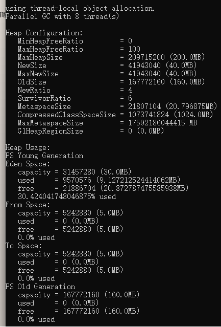
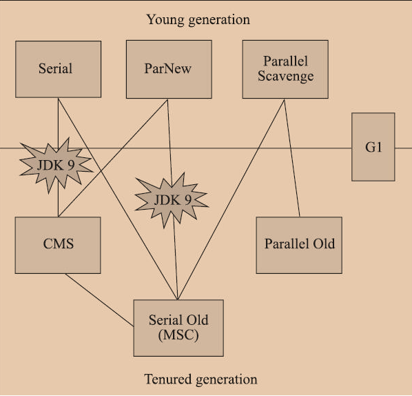

## 有哪些常用JVM参数？
* -Xmn
* -Xms
* -Xmx
* -XX:SurvivorRatio=8
* -XX:NewRatio=2
* -XX:+PrintGC

比如，以 `-XX:SurvivorRatio=6 -XX:NewRatio=4  -Xmx200M` 为例：

老年代/新生代=160M/40M = 4，加起来就是堆大小200M

Eden/Survivor = 6/(6+2)*新生代大小 = 3/4 * 40MB = 30MB

## Eden和Survivor的什么？有什么区别？

HotSpot JVM把年轻代分为了三部分：1个Eden区和2个Survivor区（分别叫from和to）。默认比例为8：1,为啥默认会是这个比例，接下来我们会聊到。一般情况下，新创建的对象都会被分配到Eden区(一些大对象特殊处理),这些对象经过第一次Minor GC后，如果仍然存活，将会被移到Survivor区。对象在Survivor区中每熬过一次Minor GC，年龄就会增加1岁，当它的年龄增加到一定程度时，就会被移动到年老代中。

因为年轻代中的对象基本都是朝生夕死的(80%以上)，所以在年轻代的垃圾回收算法使用的是复制算法，复制算法的基本思想就是将内存分为两块，每次只用其中一块，当这一块内存用完，就将还活着的对象复制到另外一块上面。复制算法不会产生内存碎片。

在GC开始的时候，对象只会存在于Eden区和名为“From”的Survivor区，Survivor区“To”是空的。紧接着进行GC，Eden区中所有存活的对象都会被复制到“To”，而在“From”区中，仍存活的对象会根据他们的年龄值来决定去向。年龄达到一定值(年龄阈值，可以通过-XX:MaxTenuringThreshold来设置)的对象会被移动到年老代中，没有达到阈值的对象会被复制到“To”区域。经过这次GC后，Eden区和From区已经被清空。这个时候，“From”和“To”会交换他们的角色，也就是新的“To”就是上次GC前的“From”，新的“From”就是上次GC前的“To”。不管怎样，都会保证名为To的Survivor区域是空的。Minor GC会一直重复这样的过程，直到“To”区被填满，“To”区被填满之后，会将所有对象移动到年老代中。

## 有哪些垃圾收集器，他们分别采用什么算法？发展历史如何？

主要指HotSpot里的。

| 垃圾回收器 | 回收算法 | 分代 | 时间 | 备注 |
| --- | --- | --- | --- | --- |
| Serial | 复制 | 新生代 | JDK1.3.1之前 | |
| ParNew | 复制 | 新生代 | JDK7之前 | Serial的多线程版本 |
| Parallel Scavenge | 复制 | 新生代 | | 主攻吞吐量 |
| Serial Old | 标记整理 | 老年代 | JDK5之前 | |
| Parallel Old | 标记整理 | 老年代 | JDK6+ | 和Parallel Scavenge搭配，是很多服务端的默认选择 |
| CMS | 标记清除 | 老年代 | JDK5之后 | JDK9标记弃用 |
| G1 | 基于Region | 整代 | JDK8后完整 | |
| ZGC | 基于Region | 整代 | JDK11 | 染色指针算法 |

图来自《深入理解Java虚拟机》第三版。

## 双亲委派模型
这个已经很熟悉了，Java的类加载机制有3层：
1. `BootstrapClassLoader`，`C++`编写的，加载`lib`下的`jar`或`-Xbootclasspath`参数配置的
2. `ExtClassLoader`，加载`lib/ext`下的`jar`或`java.ext.dirs`配置的
3. `AppClassLoader`,加载用户`java.class.path`下的类

接下来才是自定义加载器。

像Spark和Flink都有自定义的类加载器，Flink更有 `classloader.resolve-order`配置，要改成 `parent-first`才能利用双亲委派。

## JVM哪个区域不会发生内存溢出？

程序计数器是唯一没有规定内存溢出的区域。

