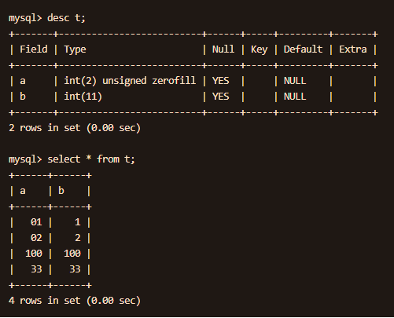

## 三范式如何理解，举例说明？
https://segmentfault.com/a/1190000013695030

1. 原子性，列不可再拆分，比如有个列为地区，就不合法，应该分为省、市、区；
2. 唯一性，每一行可以唯一区分，标准说法是非主属性都依赖于主属性，比如用户表里有：用户ID，用户所在省，市，区；
3. 消除传递依赖，就是非主属性不能依赖其他非主属性。上面区就是依赖于省市的，所以地区表要单独拆出来：地区id，省，市，区；用户表：用户ID，用户其他信息...

默认按照ER模型建立的表就符合三范式。

## InnoDB和MyISAM的区别是什么？

1. 事务上MyISAM不支持；
2. 外键，MyISAM不支持，转换会报错；
3. 索引上InnoDB是聚簇索引，索引和数据在一起，MyISAM是分离的；
4. InnoDB不保存表的行数；
5. MyISAM只支持表锁，因此适合更新少的场景；

## SQL优化手段有哪些？

1. 减少查询数据量，避免select *，只查自己需要的字段；
2. 增加必要的索引；
3. 尽量不要用不等于比较，否则会全表扫；
4. 尽量避免null判断，可能会全表扫；
5. 减少子查询；

## 哪些情况使用了索引列，但查询时不会走索引呢？

1. 使用了运算或函数
2. `!=`
3. `like`时使用后缀匹配
4. 使用索引开销比全表扫还大时

## 关于含有null值的列能走索引吗？

https://www.jianshu.com/p/3cae3e364946

做实验证明，看情况。

https://dev.mysql.com/doc/refman/5.7/en/is-null-optimization.html

MySQL对 `is null` 是有优化的，可以走索引。

## 事务的隔离级别？不可重复读和幻读的区别？
这个就太熟了。

不过MySQL默认的可重复读级别，采用`Next-Key Lock`技术能够避免幻读，相当于达到了序列化级别。

## 大表如何优化？

1. 看能否从需求上限制查询时间
2. 读写分离
3. 分库分表

## MySQL 中 varchar 与 char 的区别？varchar(30) 中的30代表的涵义？

`varchar` 与 `char` 的区别，`char` 是一种固定长度的类型，`varchar` 则是一种可变长度的类型。
`varchar(30)` 中 `30` 的涵义最多存放 `30` 个字符。
`varchar(30)` 和 `(130)` 存储 `hello` 所占空间一样，但后者在排序时会消耗更多内存，
因为 `ORDER BY col` 采用`fixed_length` 计算 `col` 长度（`memory` 引擎也一样）。

对效率要求高用 `char`，对空间使用要求高用 `varchar`。

## 为什么char比varchar快？
https://www.jianshu.com/p/a1aa86e17bf7

因为`char`固定长度，不够用空格填充，`varchar`还要记录长度，读取时就会多一步。

## 什么时候不要使用索引？

1. 经常增删改的列不要建立索引；
2. 有大量重复的列不建立索引；
3. 表记录太少不要建立索引。

## mysql的批处理模式使用？


## mysql的like中的下划线代表什么意思？

代表单个字符匹配。

## 使用JDBC接口提交mysql事务怎么写？
https://www.mysqltutorial.org/mysql-jdbc-transaction/

```java
try(Connection conn = DriverManager.getConnection(dbURL,dbUser,dbPassword);){
   conn.setAutoCommit(false);
	
   // perform operations such as insert, update, delete here
   // ..
	
   // if everything is OK, commit the transaction
   conn.commit();

} catch(SQLException e) {
   // in case of exception, rollback the transaction
   conn.rollback();
}
```

## mysql表允许的触发器有哪些？
update、insert、delete的after和before

## 最多可以使用多少列创建索引？
16

## select null <=> null 和 select null=null分别返回什么？

`<=>`: 严格比较两个NULL值是否相等，两个操作码均为NULL时，其所得值为1；而当一个操作码为NULL时，其所得值为0

```sql
mysql> select 2<=>3;
+-------+
| 2<=>3 |
+-------+
|     0 |
+-------+


mysql> select null=null;
+-----------+
| null=null |
+-----------+
|      NULL |
+-----------+

        
mysql> select null<=>null;
+-------------+
| null<=>null |
+-------------+
|           1 |
+-------------+
```

## hash索引原理，优缺点是什么？

原理是：通过对hash索引列进行hash，然后指向数据行的指针。

优点：
* 定点查询非常快，=, in

缺点：
* 只支持Memory引擎
* 不支持范围查询
* 不支持排序
* 不支持部分索引：比如A、B联合索引必须全部字段都要
* 存在hash冲突

可以通过B+树索引结合hash列来使用，应对列特别长的字段，多存一列hash值。

## 什么是聚簇索引？非聚簇索引一定要回表吗？

InnoDB中，表数据文件本身就是按B+Tree组织的一个索引结构，聚簇索引就是按照每张表的主键构造一颗B+树，同时叶子节点中存放的就是整张表的行记录数据，也将聚集索引的叶子节点称为数据页。这个特性决定了索引组织表中数据也是索引的一部分；

一般建表会用一个自增主键做聚簇索引，没有的话MySQL会默认创建，但是这个主键如果更改代价较高，故建表时要考虑自增ID不能频繁update这点。

我们日常工作中，根据实际情况自行添加的索引都是辅助索引(非聚簇索引)，辅助索引就是一个为了需找主键索引的二级索引，现在找到主键索引再通过主键索引找数据；

如果查询的就是非聚簇索引列，自然不需要回表了。

## 如何查看sql是否使用了索引？
使用`explain`查看，`explain`的各个字段解释：

https://dev.mysql.com/doc/refman/8.0/en/explain-output.html#explain-output-columns

## mysql的锁机制，共享锁和排他锁是什么？行、页、表级锁？


## 为什么不建议使用NULL 列？
https://dev.mysql.com/doc/refman/8.0/en/column-count-limit.html

mysql的MyISAM表的NULL列其实是占空间的。


## int(1) 和 int(11)有什么区别？

用于在展示时对长度进行补0，要配合 `zerofill`使用。



## binlog是什么？有什么作用？有几种格式？和redo log有什么区别？
https://segmentfault.com/a/1190000039707144\

binlog是MySQL执行引擎的执行日志，记录表和数据的变更。可用来做数据恢复和主从同步，其基本格式有3种：
1. Statement：记录DDL，DML执行语句，存在的问题是有些带有实时性函数比如`current_date`，无法准确描述；
2. ROW格式：记录行的变更细节，可能会产生很多修改；
3. MIXED：混合2种，优缺补齐。

`redo log`是`InnoDB`引擎才有的功能，用来记录数据变更的页修改，属于物理日志，且采用的循环写、固定大小的日志文件。
`redo log`会先于`binlog`写入，用于在事务中`MySQL`挂了后重启能恢复事务，也就是`crash-safe`。

## undo log和redo log是什么？实现原理怎样？

* `redo log`保证`crash-safe`，`undo log`保证事务回滚，也就是在事务开始前记录数据的原始状态，以便回滚恢复。
* `undo log`也用于`MVCC`，当读取的行被事务锁定时，可以通过`undo log`获取之前的数据。
* `undo log`采用日志段的形式记录，5.6之后有独立的表空间。

实现原理：TODO

## 讲讲B+树的实现，和B树有什么区别？

TODO


